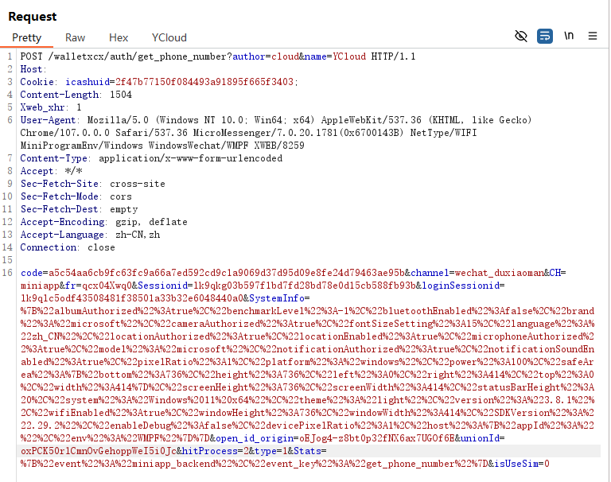
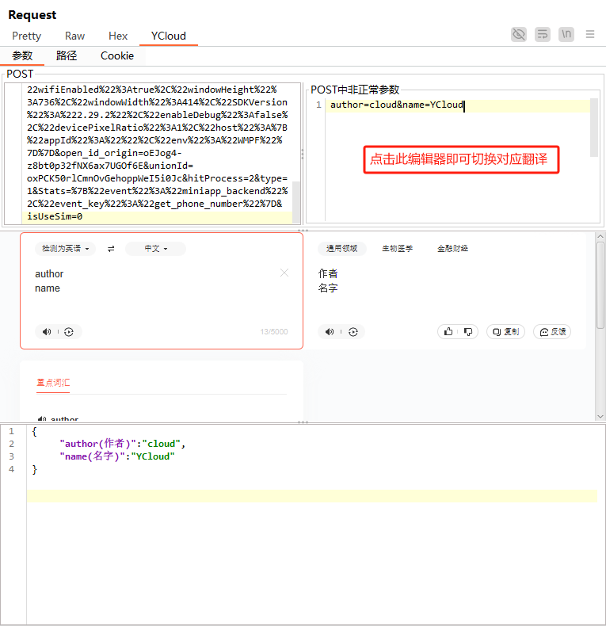
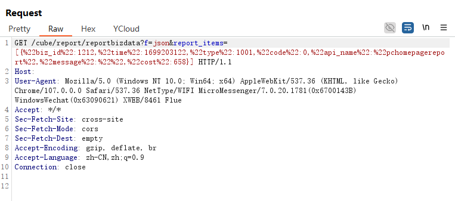
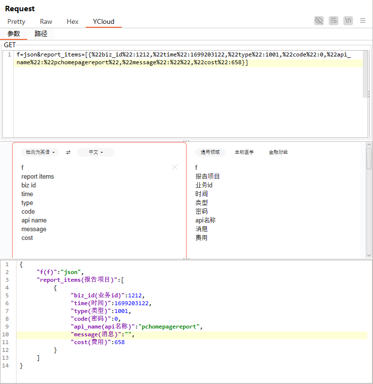
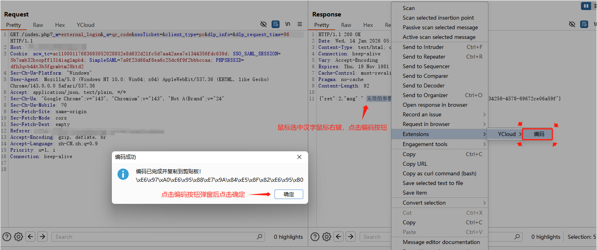
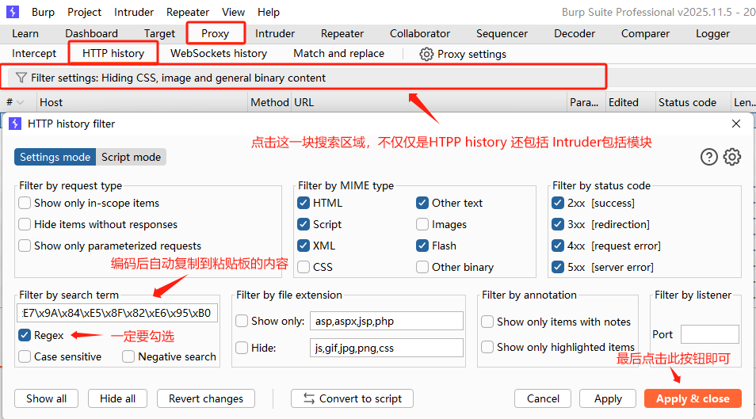

> 这是我严格意义上的第一款工具，从 2022 年初立项到如今的重构发布，跨越了四年的时光，它记录了我从行业新人到开发者的成长。

 

YCloud 是一款专为安全从业者和开发者设计的 HTTP 参数处理工具。

旨在解决渗透测试或接口调试过程中，频繁遇到的参数编码乱码、嵌套复杂、以及中英文语义对照困难等痛点。

---

1. 案例展示：
针对各类常见编码以及传参方式都能处理妥当

<table align="center"> <tr> <td align="center" valign="center"></td> <td align="center" valign="center"></td> <td align="center" valign="center"></td> </tr> </table>

2. 案例展示：
针对嵌套多层的复杂数据结构，提供直观的树状层级展示与快速编辑。

<table align="center"> <tr> <td align="center" valign="center"></td> <td align="center" valign="center"></td> </tr> </table>

3. 特色功能：
解决在 Burp Suite 中直接搜索中文无法匹配的痛点。通过 YCloud 获取特征编码，直接在 Burp 中定位数据包。

<table align="center"> <tr> <td align="center" valign="center"> <b>第一步：获取中文编码</b>

 </td> <td align="center" valign="center"> <b>第二步：在 Burp 中搜索</b>

 </td> </tr> </table>
